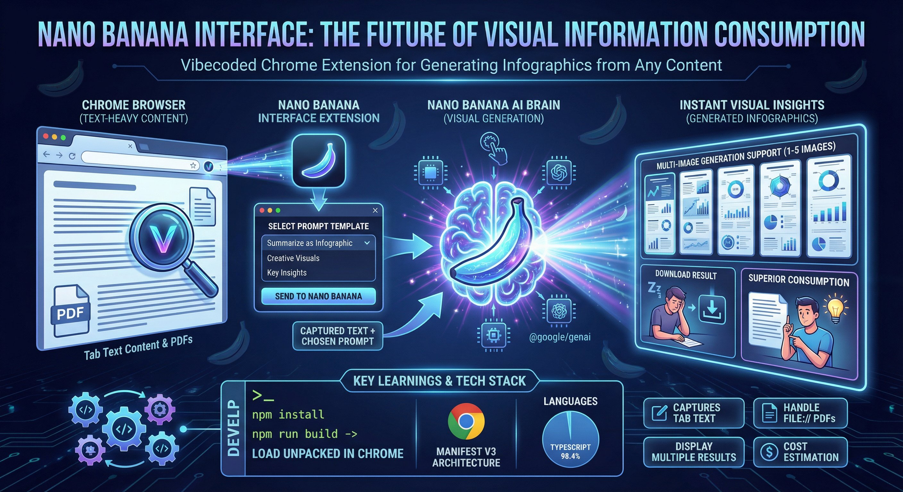

# Nano Banana Interface (Chrome Extension)

This repo builds a **Chrome Manifest V3 extension** that:
- Automatically captures the current tab's text content when opened
- Wraps it with a selected **prompt template**
- Submits the prompt to Nano Banana (via `@google/genai`)
- Shows the resulting image(s) and allows download
- Multiple iterations can be generated at once (1-5)

## Setup

1. Install deps:
   - `npm install`
2. Build the extension:
   - `npm run build`
3. Load unpacked in Chrome:
   - Go to `chrome://extensions`
   - Enable **Developer mode**
   - Click **Load unpacked**
   - Select the `dist/` folder

### API Key
You **must add your own Google Generative AI API key** to use this extension:
1. Open the extension popup
2. Click the **Settings** icon (gear icon)
3. Enter your API key in the "API Key" field
4. The key will be saved locally in your browser